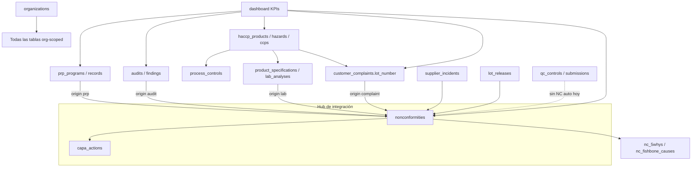

# Nura — Auditoría de arquitectura (Paso 0)

> Generado: 2026-06-06  
> Propósito: inventario del QMS existente vs. módulos core absolutos, mapa de dependencias y plan de limpieza **preparado pero no ejecutado**.

---

## 1. Stack tecnológico y patrones actuales

| Capa | Tecnología |
|------|------------|
| Framework | Next.js 14.2 (App Router) |
| Lenguaje | TypeScript 5.7 |
| UI | Tailwind CSS 3.4, componentes propios en `components/ui/` |
| Iconos | lucide-react |
| Tipografía | Plus Jakarta Sans (`@fontsource/plus-jakarta-sans`) |
| Backend / DB | Supabase (PostgreSQL + RLS + Auth + Realtime) |
| Auth | `@supabase/ssr` (cookies), middleware pipeline |
| Estado | React local (`useState`); sin Redux/Zustand |
| Formularios | HTML nativo + componentes `Input`/`Button`; sin react-hook-form |
| Email | `lib/email/` (templates + envío) |
| Tests | No configurados |

### Patrones de arquitectura (respetar en pasos 1–10)

```
app/
  (auth)/          → login, register (deshabilitado)
  (dashboard)/     → módulos autenticados
  api/             → REST handlers (Next Route Handlers)
  onboarding/      → wizard primera vez
  registro-calidad/[token]/  → formulario público sin sesión

components/{modulo}/   → UI por dominio
lib/{modulo}/          → lógica, constantes, validación
types/database.ts      → espejo de esquema Supabase
supabase/migrations/   → SQL versionado (001–019)
```

**Multi-tenant:** todas las tablas de negocio llevan `organization_id` + políticas RLS basadas en `profiles.organization_id`.

**Roles:** `admin` | `quality_manager` | `operator`  
- `operator`: solo `/dashboard` y `/prps/*` (middleware en `lib/team/permissions.ts`)  
- `admin`: acceso a `/configuracion/*` y gestión de usuarios  
- `quality_manager`: todos los módulos excepto configuración

**Infraestructura transversal (no es módulo QMS, no eliminar):**
- Onboarding (`/onboarding`, RPC `complete_user_onboarding`)
- Acceso manual (`organizations.access_status`, `/acceso-pendiente`, `/admin/acceso`)
- Equipo e invitaciones (`/configuracion/usuarios`, `/api/team/*`, `/invitacion/[token]`)
- Notificaciones (campana + cron `/api/notifications/cron`)
- Configuración de empresa (`/configuracion/*`)
- Landing pública (`/`)

**Sistema de diseño:** paleta forest/sage/ink en `globals.css`, `ModuleHeader`, `Badge`, `Button`, tablas blancas con `border-border`, labels en `font-mono uppercase tracking-wider`.

---

## 2. Inventario de módulos existentes

### 2.1 Módulos core absolutos — estado

| Módulo core | Ruta / ubicación | Estado | Notas |
|-------------|------------------|--------|-------|
| **Control de Documentos** | — | **Falta** | No hay tablas ni rutas. Solo docs de proveedor (`supplier_documents`). |
| **Registros Digitales de Producción** | Parcial: `/prps/*/ejecutar`, `/laboratorio/control-proceso`, `/control-calidad`, `/registro-calidad/[token]` | **Parcial** | Formularios/checklists existen pero dispersos; sin constructor unificado, sin plantillas reutilizables ni modo offline. |
| **No Conformidades + CAPA** | `/capa/*` | **Completo** | NC con orígenes múltiples, 5 Whys, Ishikawa, acciones CAPA, escalamiento API. Falta workflow secuencial estricto del Paso 3. |
| **Auditorías e Inspecciones** | `/auditorias/*` | **Completo** | Programación, ejecución, informe, hallazgos → NC. Falta calendario y plantillas configurables sin código. |
| **Trazabilidad y Simulacro de Retiro** | Parcial: PRP `traceability`, `lot_number` en lab/reclamos/NC | **Parcial** | Sin genealogía N:M, sin mock recall, sin árbol exportable. |
| **HACCP / Plan de Inocuidad** | `/haccp/*` | **Completo** | Productos, pasos, peligros, PCCs, biblioteca de peligros. Falta versionado formal (Paso 5) y vínculo a registros. |
| **Gestión de Proveedores** | `/proveedores/*` | **Completo** | CRUD, documentos, evaluaciones, incidentes → NC. Falta scorecard automático y portal proveedor. |
| **Capacitación (LMS)** | — | **Falta** | Sin tablas, rutas ni componentes. Referencias textuales en bibliotecas de peligros/auditoría. |
| **Quejas de Clientes** | `/reclamos/*` | **Completo** | Dashboard, detalle, tendencias, NC vinculada, panel de lote. |
| **Dashboard KPIs** | `/dashboard` | **Parcial** | KPIs operativos + ejecutivos (`lib/dashboard/`). No incluye aún docs, capacitación, trazabilidad/recall ni todos los widgets del Paso 10. |

### 2.2 Módulos existentes FUERA del core absoluto

| Módulo | Rutas | Tablas principales | Relación con core | Candidato a eliminar |
|--------|-------|-------------------|-------------------|---------------------|
| **PRPs (Prerrequisitos)** | `/prps/*` | `prp_programs`, `prp_checklist_items`, `prp_records`, `prp_record_items` | Genera NC (`origin: prp`); dashboard mide cumplimiento PRP; operadores lo usan diariamente | **Evaluar** — no está en core pero es el registro operativo más usado hoy. Paso 2 podría absorberlo o coexistir. |
| **Laboratorio (LIMS)** | `/laboratorio/*` | `product_specifications`, `sampling_plans`, `lab_analyses`, `lab_results`, `lot_releases`, `process_controls` | NC (`origin: lab`), lotes, especificaciones ligadas a `haccp_products` | **Candidato fuerte** — tipo LIMS, no está en core. Datos de lote podrían migrarse a Trazabilidad (Paso 6). |
| **Control de calidad (campo)** | `/control-calidad/*`, `/registro-calidad/[token]` | `qc_controls`, `qc_control_parameters`, `qc_field_links`, `qc_submissions`, `qc_submission_readings` | Formularios configurables + gráficos; solapa con Registros Producción (Paso 2) | **Candidato** — funcionalidad duplicada respecto al Paso 2; conviene fusionar, no borrar a ciegas. |
| **UI Test (dev)** | `/ui-test` | — | Sandbox de componentes | **Candidato menor** — eliminar en producción |
| **Landing marketing** | `/` | — | Adquisición | **Mantener** — no es módulo QMS |
| **Admin plataforma** | `/admin/acceso`, `/api/admin/*` | — | Provisioning manual | **Mantener** — infraestructura |

### 2.3 Módulos core que NO existen (crear en pasos 1–10)

1. **Control de Documentos** — Paso 1  
2. **Registros Producción unificados** — Paso 2 (consolidar PRP/QC/Lab parcial)  
3. **Capacitación LMS** — Paso 8  
4. **Trazabilidad + Mock Recall** — Paso 6  
5. **Dashboard KPIs completo** — Paso 10 (extender el existente)

---

## 3. Mapa de rutas (inventario completo)

### Públicas / auth
| Ruta | Archivo | Propósito |
|------|---------|-----------|
| `/` | `app/page.tsx` | Landing |
| `/login` | `app/(auth)/login/page.tsx` | Inicio de sesión |
| `/register` | `app/(auth)/register/page.tsx` | Redirige a login (acceso manual) |
| `/onboarding` | `app/onboarding/page.tsx` | Alta de organización |
| `/acceso-pendiente` | `app/acceso-pendiente/page.tsx` | Org sin acceso activo |
| `/invitacion/[token]` | `app/invitacion/[token]/page.tsx` | Aceptar invitación |
| `/registro-calidad/[token]` | `app/registro-calidad/[token]/page.tsx` | Formulario QC público |

### Dashboard autenticado
| Ruta | Módulo |
|------|--------|
| `/dashboard` | KPIs |
| `/haccp`, `/haccp/nuevo`, `/haccp/[id]` | HACCP |
| `/prps`, `/prps/[type]/configurar\|ejecutar\|historial` | PRPs |
| `/auditorias`, `/auditorias/[id]/ejecutar\|informe` | Auditorías |
| `/capa`, `/capa/nueva`, `/capa/[id]` | NC/CAPA |
| `/laboratorio`, `/laboratorio/nuevo`, `/laboratorio/especificaciones`, `/laboratorio/control-proceso` | Laboratorio |
| `/control-calidad`, `/control-calidad/controles/*` | Control calidad |
| `/proveedores`, `/proveedores/nuevo`, `/proveedores/[id]` | Proveedores |
| `/reclamos`, `/reclamos/nuevo`, `/reclamos/[id]` | Quejas |
| `/configuracion/*` | Configuración |
| `/admin/acceso` | Admin plataforma |
| `/ui-test` | Dev sandbox |

### API (`app/api/`)
| Ruta | Propósito |
|------|-----------|
| `/api/admin/organizations`, `provision-client`, `provision-user` | Provisioning |
| `/api/capa/escalate` | Escalamiento CAPA vencidas |
| `/api/notifications/cron`, `audit-completed`, `complaint-critical` | Notificaciones |
| `/api/quality-control/submit` | Envío formulario QC público |
| `/api/settings/export`, `organization`, `notifications` | Configuración |
| `/api/team/*` | Usuarios e invitaciones |

---

## 4. Esquema Supabase (41 tablas de negocio)

### Migraciones aplicables (orden)
| # | Archivo | Tablas / cambios |
|---|---------|------------------|
| 001 | `001_auth_onboarding.sql` | `organizations`, `profiles` |
| 002 | `002_haccp_products.sql` | `haccp_products`, `haccp_process_steps` |
| 003 | `003_haccp_hazards_ccps.sql` | `haccp_hazards`, `haccp_ccps` |
| 004 | `004_prp_programs.sql` | `prp_*`, `nonconformities` |
| 005 | `005_audits.sql` | `audits`, `audit_checklist_items`, `audit_findings` |
| 006 | `006_capa.sql` | `capa_actions`, `nc_5whys`, `nc_fishbone_causes` |
| 007 | `007_notifications.sql` | `notifications` |
| 008 | `008_manual_access.sql` | ALTER `organizations` |
| 009 | `009_invitations.sql` | `invitations` |
| 010 | `010_company_settings.sql` | `notification_preferences` |
| 011 | `011_quality_lab.sql` | Lab + `process_controls` |
| 012 | `012_suppliers.sql` | `suppliers`, `supplier_*` |
| 013 | `013_customer_complaints.sql` | `customer_complaints`, `complaint_photos` |
| 014–017 | fixes / bootstrap / RLS | RPCs, triggers |
| 018 | `018_quality_control.sql` | `qc_*` |
| 019 | `019_qc_multi_parameters.sql` | `qc_control_parameters`, `qc_submission_readings` |

Verificar estado: `supabase/check_state.sql`

---

## 5. Mapa de dependencias entre módulos



### Tablas compartidas (⚠️ no eliminar sin análisis)

| Tabla | Usada por |
|-------|-----------|
| `nonconformities` | CAPA, auditorías, PRPs, lab, reclamos, proveedores, lot_releases |
| `haccp_products` | HACCP, laboratorio (specs/analyses), reclamos (producto) |
| `lot_number` (columna) | lab_analyses, lot_releases, process_controls, nonconformities, customer_complaints |
| `profiles` / `organizations` | Todo el sistema |
| `notifications` | Cross-cutting |

### Integraciones NC existentes (código)

| Origen | Archivo | `origin` |
|--------|---------|----------|
| PRP fallido | `components/prp/execute-prp.tsx` | `prp` |
| Auditoría | `components/auditorias/audit-report.tsx` | `audit` |
| Laboratorio | `components/lab/new-analysis-wizard.tsx` | `lab` |
| Reclamo | `components/complaints/complaint-detail-view.tsx` | `complaint` |
| Manual | `/capa/nueva` | `manual` |

**Pendiente hoy:** NC automática desde control de calidad, registro producción unificado, capacitación → CAPA.

---

## 6. Navegación actual (sidebar)

Orden en `lib/team/permissions.ts`:

1. Dashboard  
2. Plan HACCP  
3. PRPs  
4. Auditorías  
5. No Conformidades  
6. Laboratorio  
7. Control de calidad  
8. Proveedores  
9. Reclamos  
10. Configuración (solo admin)  
11. Acceso manual (solo platform admin)

---

## 7. Brechas detectadas vs. roadmap Pasos 1–10

| Paso | Brecha principal en código actual |
|------|-----------------------------------|
| 1 | Sin módulo documental ISO (versiones, acuses, firma) |
| 2 | Sin constructor drag-and-drop; registros en 3 módulos distintos |
| 3 | CAPA no secuencial con firmas por etapa; sin cuarentena automática |
| 4 | Plantillas auditoría en código (`audit-checklists.ts`), no DB configurable |
| 5 | HACCP sin versionado ni link a plantillas de registro |
| 6 | Sin BOM lotes, CTEs, mock recall |
| 7 | Proveedores sin scorecard automático ni portal |
| 8 | Capacitación inexistente |
| 9 | Reclamos completos; falta SLA configurable y dashboard analítico ampliado |
| 10 | Dashboard parcial; sin modo kiosco planta |

### Deuda técnica transversal
- `lib/settings/export.ts` **no exporta** tablas `qc_*` (018/019)
- `RoleGate` definido pero **no usado** (RBAC solo en middleware)
- Sin framework de tests
- Sin modo offline

---

## 8. Plan de eliminación segura (NO EJECUTADO)

> **Esperando tu confirmación explícita** sobre qué módulos eliminar antes de tocar código o base de datos.

### Escenario A — Eliminar solo **UI Test** (riesgo: ninguno)

**Archivos a borrar:**
- `app/(dashboard)/ui-test/page.tsx`

**SQL:** ninguno.

---

### Escenario B — Eliminar **Laboratorio** (riesgo: medio-alto)

**Impacto:** pierdes análisis de laboratorio, especificaciones, liberación de lotes y control de proceso en `/laboratorio`. Las NC con `origin: lab` y `lot_releases.nc_id` quedarían huérfanas de origen activo.

**Archivos / rutas obsoletos:**
```
app/(dashboard)/laboratorio/
components/lab/
lib/lab/
app/api/ — (ninguna ruta lab exclusiva; lógica en componentes)
```

**Menú:** quitar entrada `laboratorio` de `lib/team/permissions.ts` y `sidebar.tsx`.

**Dashboard:** quitar referencias en `lib/dashboard/data.ts` si las hay (hoy agrega lab indirectamente vía NC).

**Export:** quitar de `lib/settings/export.ts`:  
`product_specifications`, `sampling_plans`, `lab_analyses`, `lab_results`, `lot_releases`, `process_controls`

**Tablas compartidas — NO eliminar sin migración de datos:**
- `haccp_products` — **mantener** (HACCP)
- `nonconformities` — **mantener**; limpiar filas `origin = 'lab'` o conservar como histórico

**SQL propuesto (revisar + respaldo antes de ejecutar):**

```sql
-- ⚠️ RESPALDO OBLIGATORIO. Solo ejecutar si confirmas eliminar Laboratorio.

-- 1) Desvincular NC de lot_releases antes de borrar
UPDATE nonconformities SET origin_ref_id = NULL
WHERE origin = 'lab';  -- o conservar histórico sin borrar NC

-- 2) Eliminar tablas lab (orden por FK)
DROP TABLE IF EXISTS lab_results CASCADE;
DROP TABLE IF EXISTS lab_analyses CASCADE;
DROP TABLE IF EXISTS sampling_plans CASCADE;
DROP TABLE IF EXISTS product_specifications CASCADE;
DROP TABLE IF EXISTS lot_releases CASCADE;
DROP TABLE IF EXISTS process_controls CASCADE;

-- 3) Opcional: eliminar valor 'lab' del enum nc_origin si existe
-- (requiere verificar tipo enum en 004/006; puede necesitar ALTER TYPE ... DROP VALUE)
```

---

### Escenario C — Eliminar **Control de calidad** (riesgo: medio)

**Impacto:** pierdes formularios de campo con enlace público y gráficos QC. Funcionalidad objetivo del **Paso 2**.

**Archivos / rutas obsoletos:**
```
app/(dashboard)/control-calidad/
app/registro-calidad/
components/quality-control/
lib/quality-control/
app/api/quality-control/submit/route.ts
middleware.ts — excepción pública /registro-calidad
```

**SQL propuesto (tras respaldo):**

```sql
-- ⚠️ RESPALDO OBLIGATORIO

DROP TABLE IF EXISTS qc_submission_readings CASCADE;
DROP TABLE IF EXISTS qc_submissions CASCADE;
DROP TABLE IF EXISTS qc_field_links CASCADE;
DROP TABLE IF EXISTS qc_control_parameters CASCADE;
DROP TABLE IF EXISTS qc_controls CASCADE;

DROP FUNCTION IF EXISTS public.submit_qc_field_form;
```

---

### Escenario D — Eliminar **PRPs** (riesgo: ALTO — no recomendado sin reemplazo Paso 2)

**Impacto:** operadores pierden su único módulo operativo; dashboard pierde `prpCompletionRate`; desaparece generación NC `origin: prp`.

**Recomendación:** **no eliminar** hasta implementar Paso 2 y migrar checklists/registros.

Si igual se elimina, SQL incluiría `prp_record_items`, `prp_records`, `prp_checklist_items`, `prp_programs` — pero **`nonconformities` debe conservarse**.

---

### Escenario E — Recomendación consolidada para el roadmap

| Acción | Módulo | Cuándo |
|--------|--------|--------|
| Eliminar ya | UI Test | Paso 0 (tras tu OK) |
| Fusionar → Paso 2 | PRPs + Control calidad + partes de Lab | Pasos 2 y 6 (no borrar tablas aún) |
| Eliminar o reducir | Laboratorio LIMS | Tras Paso 6 absorba lotes/trazabilidad |
| Crear nuevo | Documentos, Capacitación, Trazabilidad/Recall | Pasos 1, 6, 8 |
| Extender | Dashboard, CAPA workflow, HACCP versionado | Pasos 3, 5, 10 |

---

## 9. Variables de entorno actuales

| Variable | Uso |
|----------|-----|
| `NEXT_PUBLIC_SUPABASE_URL` | Cliente Supabase |
| `NEXT_PUBLIC_SUPABASE_ANON_KEY` | Cliente Supabase |
| `SUPABASE_SERVICE_ROLE_KEY` | Admin client (onboarding, export, QC público, cron) |
| `NURA_ADMIN_EMAILS` | Emails platform admin (comma-separated) |
| `CRON_SECRET` | Protección `/api/notifications/cron` |
| Config email | Variables en `lib/email/` (revisar `.env.local`) |

**Paso 0 no requiere nuevas variables de entorno.**

---

## 10. Resumen ejecutivo Paso 0

| Métrica | Valor |
|---------|-------|
| Rutas app | ~43 |
| Tablas DB | 41 (+ auth) |
| Migraciones | 19 |
| Core completo | 5/10 (NC/CAPA, Auditorías, HACCP, Proveedores, Quejas) |
| Core parcial | 3/10 (Registros, Trazabilidad, Dashboard) |
| Core faltante | 2/10 (Documentos, Capacitación) |
| Fuera de core | PRPs, Laboratorio, Control calidad, UI test |

**Decisión requerida antes de limpiar:** confirma qué escenarios (A–E) aplicar. Por defecto sugerimos **solo Escenario A (UI Test)** en Paso 0 y posponer eliminaciones grandes hasta Pasos 2 y 6.
